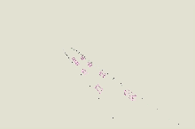

# Racing Sentiment Analysis


## Summary
Sim-racing games often suffer from poor moderation and often unfairly penalize both drivers for an incident.
We provide a large-scale dataset that enables the analysis of human driver behaviour.
### Contributions
- Dataset of 2,014 race sessions across 11 tracks.
- VAE based model (in progress).

## Dataset

[//]: # ([![]&#40;graphics/data_vis.gif&#41;]&#40;https://youtu.be/UDB-qXZQGbE&#41;</br>)
<a href="https://youtu.be/UDB-qXZQGbE">
  
</a>

Data visualization with `visualize/data_player.py`.
### Folder structure
```
.
├── session_data    # Session data
├── track_data      # Track point data
├── meta_data       # Optional, generated by sample_builder.py
└── file_meta.npy   # Optional, generated by sample_builder.py
```
### Session data
```
.
├── ...
├── session_data
│   ├── train
│   │   ├── 0.npy   # Session 0
│   │   ├── 1.npy   # Session 1
│   │   └── ...
│   ├── test
│   └── val
└── ...
```
The npy files are structured as follows:
```
{
    'data': np.array,       # Session data
    'track_id': int,        # Track point data
}
```
where data has shape:
```
(frame_id, car_id, (pos, contact_point_1, contact_point_2, contact_point_3, contact_point_4), 3)
```
Note: although mostly addressed in ```sample_builder.py```, some cars may teleport to the pitlane or disconnect during a session.

### Track data
```
.
├── ...
├── track_data
│   ├── 0.npy   # Track 0
│   ├── 1.npy   # Track 1
│   ├── ...
│   └── 11.npy  # Track 11
└── ...
```
The npy files are structured as follows:
```
{
    'left_track': np.array,     # Left track points
    'right_track': np.array,    # Right track points
    'racing_line': np.array,    # Racing line points
}
```
where the arrays have shape `(n, 3)`.

### Download
> Dataset is free to use and available to download from [HuggingFace](https://huggingface.co/datasets/NaOHL1/OnlineSimRacing).
> 
>Please consider [reaching out](https://www.linkedin.com/in/noahl1/) if you are hiring! 😊

[//]: # (## Example VAE solution)

[//]: # (### Architecture)

[//]: # (### )
